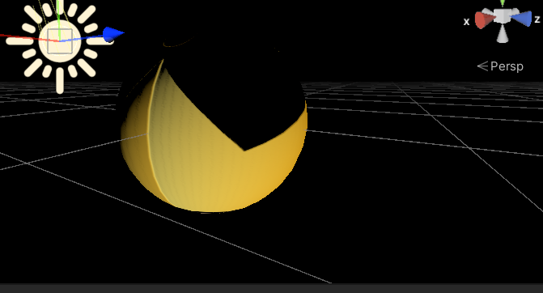
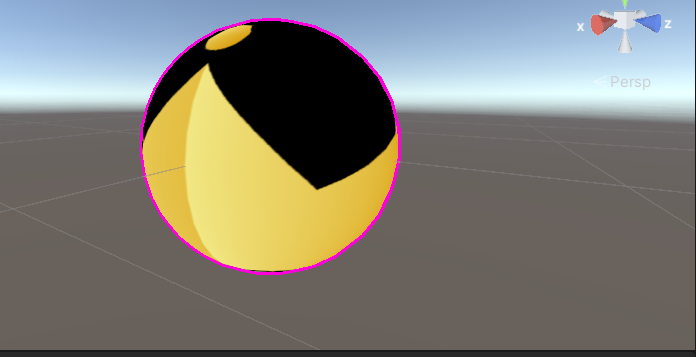

# これは何？
プログラムワークショップ4の管理用

# 使い方

- 本リポジトリ(tpu-game-2024/PGWS4)をforkしてください。
- fork先のリポジトリを更新してください
- 結果を画面キャプチャして、下記のリンクで見れるようにしてください
- 完成したら本リポジトリのmainブランチにpull requestを投げてください

# 結果

## 第2回

## 第3回

## 第4回

## 第5回

## 第6回

## 第7回

## 第8回

## 第9回

https://github.com/user-attachments/assets/42d82123-96b7-4597-bb62-b7b7fd285954

## 第10回

## 第11回

## 第12回

## 第13回

## 第14回

## 第15回

# 締め切り
次の授業の2日前（水曜日の授業であれば月曜日一杯）
